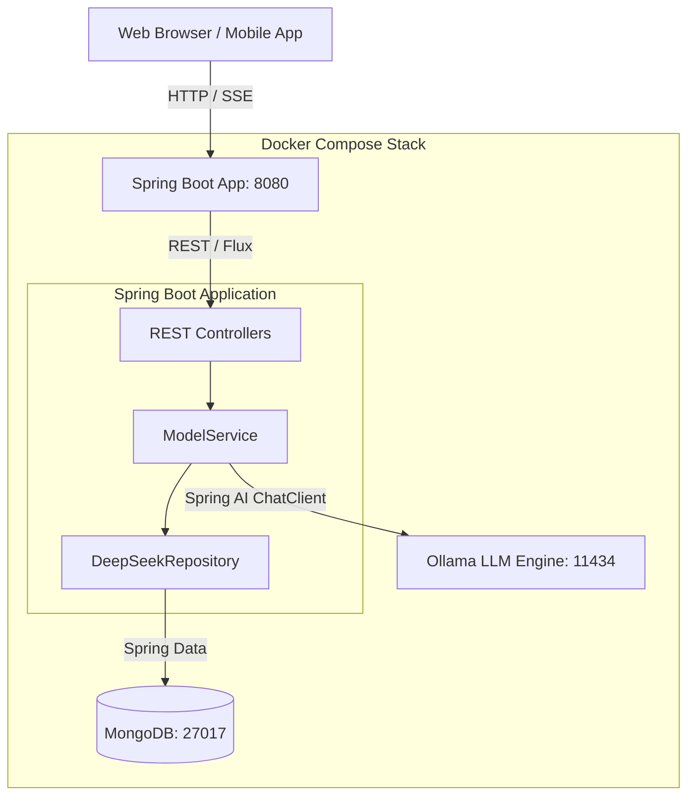
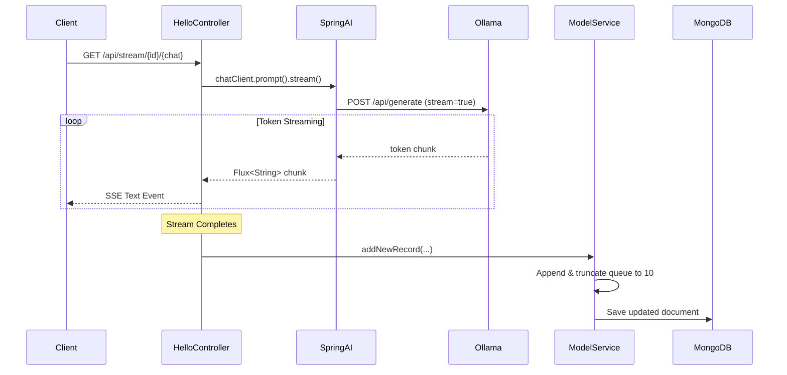
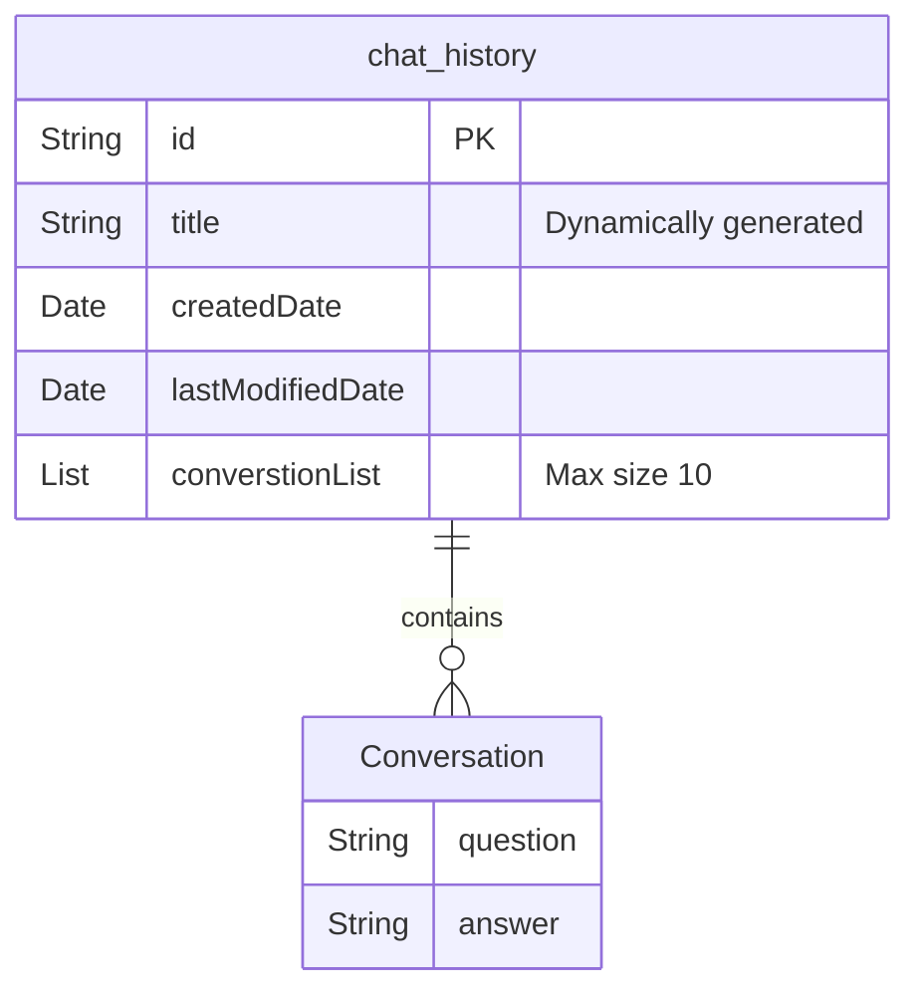

# 🧠 Local LLM Backend (Spring AI)

A production-ready, privacy-first backend service built to interact with local Large Language Models (LLMs) via Ollama. It leverages Java 21, Spring Boot, Spring AI, and MongoDB to provide dynamic model discovery, reactive SSE streaming, and persistent conversation context management.

---

## 📌 Overview

This project serves as a robust middleware layer between frontend applications and local Ollama instances. It intercepts chat prompts, manages conversational history in MongoDB using a sliding window algorithm (to prevent token limit exhaustion), and formats inputs for reasoning models (e.g., DeepSeek, QwQ).

### Why Local LLMs?
- **Privacy**: No external API calls; your data never leaves the server.
- **Cost**: No per-token charges from cloud providers.
- **Latency**: True reactive streaming directly to the client.

---

## 🚀 Features

- ⚡ **True Reactive Streaming**: Uses Spring WebFlux to stream tokens to clients via Server-Sent Events (SSE).
- 🧩 **Dynamic Model Discovery**: Automatically polls the local Ollama instance for installed models with resilient fallbacks.
- 💾 **Context Management**: Persists chat threads to MongoDB, enforcing a strict 10-message sliding window to avoid OOM exceptions on constrained hardware.
- 🧠 **Reasoning Engine Support**: Injects system prompts to cleanly extract and handle `<think>` blocks.
- 🐳 **Docker Ready**: One-command deployment via `docker-compose`.
- 📖 **OpenAPI Docs**: Integrated Swagger UI for easy endpoint testing.

---

## 🛠 Tech Stack

- **Language**: Java 21 LTS
- **Framework**: Spring Boot 3.4
- **AI Integration**: Spring AI (Ollama Starter)
- **Database**: MongoDB (Spring Data Mongo)
- **Build**: Maven
- **Containerization**: Docker & Docker Compose

---

## 🏗 Architecture

### System Flow


### Request Flow (True Streaming)


### Database Model


---

## 💻 Installation & Setup

### Prerequisites
- Docker & Docker Compose
- *Or* Java 21, Maven, MongoDB, and Ollama installed locally.

### Option 1: Docker (Recommended)
The easiest way to get started is using Docker Compose.

```bash
# Clone the repository
git clone https://github.com/sudeshsudhii/Local-LLM-Application.git
cd Local-LLM-Application

# Start the stack (App + MongoDB + Ollama)
docker-compose up -d --build
```
*Note: You must pull an Ollama model manually the first time:*
`docker exec -it <ollama-container-id> ollama run qwen3:1.7b`

### Option 2: Local Build
```bash
# Start your local MongoDB on port 27017
# Start your local Ollama on port 11434

# Build and run the Spring Boot app
mvn clean install
mvn spring-boot:run
```

---

## 📚 API Documentation

Once the application is running, navigate to the Swagger UI to view and test all endpoints:
**👉 http://localhost:8080/swagger-ui.html**

### Key Endpoints
- `PUT /api/create` - Initializes a new chat thread.
- `GET /api/stream/{id}/{chat}` - Submits a prompt and returns an SSE stream.
- `GET /api/models` - Lists all dynamically discovered models.
- `GET /api/get-all` - Retrieves all saved chat histories.

---

## 🤝 Contributing

We welcome contributions! Please see our [CONTRIBUTING.md](CONTRIBUTING.md) for details on how to submit issues, feature requests, and pull requests.

## 📄 License

This project is licensed under the MIT License.